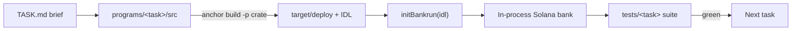

<p align="center">
  <a href="https://redduck.io">
    <picture>
      <source media="(prefers-color-scheme: dark)" srcset=".github/assets/redduck-logo-dark.svg">
      
    </picture>
  </a>
</p>

<h1 align="center">RedDuck Academy — Solana Template</h1>

<p align="center">
  <b>Anchor programs with <code>// TODO</code>s where the logic goes, and a bankrun suite waiting to turn green.</b>
</p>

---

An Anchor + Rust learning template by [RedDuck](https://redduck.io) — a numbered series of tasks with a read-the-brief, implement, test workflow. Each task is an on-chain Anchor program you fill in, tested with [bankrun](https://kevinheavey.github.io/solana-bankrun/): a fast in-process bank, no local validator and no airdrops. It's one Anchor workspace, but every task builds and tests on its own, so an unfinished program never blocks another.

## Built with

| Area | Technology |
| --- | --- |
| Programs | Rust + [Anchor](https://www.anchor-lang.com/) 0.31.1 |
| Toolchain | [Solana CLI](https://docs.anza.xyz/cli/install) 2.x, Solana platform tools |
| Tests | [`solana-bankrun`](https://kevinheavey.github.io/solana-bankrun/) + `anchor-bankrun`, Mocha + Chai via `ts-mocha` |
| Client | [`@coral-xyz/anchor`](https://www.anchor-lang.com/), `@solana/web3.js`, `@solana/spl-token` |
| Task libraries | `merkletreejs` for the airdrop task |
| Quality | `cargo fmt` + Clippy (`-D warnings`), Prettier |
| Runtime | Node.js 20+ (22 LTS recommended, see `.nvmrc`), npm, TypeScript |

New here? **[INSTALL.md](INSTALL.md)** walks through installing the whole toolchain — Rust, Solana CLI, Anchor, Node — from scratch.

## How it works



Per-task scripts compile a single crate (`anchor build -p <crate>`) and each bankrun suite loads only the program under test — so the starters, which deliberately don't compile until you implement them, stay out of each other's way. A workspace-wide `anchor build` only succeeds once every task is done.

```
.
├── Anchor.toml              # workspace config + program IDs
├── Cargo.toml               # Rust workspace
├── programs/                # one Anchor program per task
│   ├── 01-donor-vault/      # ← start here (ships with full tests)
│   │   ├── src/             # lib.rs + constants/error/state/instructions
│   │   └── TASK.md          # brief — read this first
│   ├── 02-staking/
│   ├── 04-merkle-airdrop/
│   └── 05-raffle/
└── tests/                   # one bankrun suite per task, plus shared helpers
    ├── helpers/
    └── 01-donor-vault/donor-vault.test.ts
```

## Tasks

| # | Task | Program crate | Status |
| --- | --- | --- | --- |
| 01 | [`01-donor-vault`](programs/01-donor-vault/) | `donor_vault` | starter (start here) |
| 02 | [`02-staking`](programs/02-staking/) | `staking` | starter |
| 03 | _reserved_ | — | — |
| 04 | [`04-merkle-airdrop`](programs/04-merkle-airdrop/) | `merkle_airdrop` | starter |
| 05 | [`05-raffle`](programs/05-raffle/) | `raffle` | starter |

Every task is a **starter** — a module skeleton with `// TODO`s for the accounts, state, errors and logic. Start with `01-donor-vault`: its brief is the most detailed and it ships with its **complete** test suite, so you only write the program. The later tasks give one happy-path test and leave the rest to you. (`03` is intentionally left open for a future task.)

## Getting started

Prerequisites: Rust, Solana CLI 2.x, Anchor 0.31.1, Node.js 20+.

```bash
anchor --version   # anchor-cli 0.31.1
solana --version   # 2.x
node --version     # v20+

npm install
npm run test:donorVault   # build + run 01's suite (red until you implement the program)
```

Each task has its own script that builds just that program and runs its suite:

```
test:donorVault   test:staking   test:merkleAirdrop   test:raffle
```

For a starter, its script fails until you implement the program — making it green is the task. `npm test` builds and runs the **whole** workspace at once, so it only works once every task compiles.

Repo-wide helpers:

```bash
npm run lint          # cargo fmt --check + clippy
npm run lint:fix      # cargo fmt
npm run prettier      # format TS/JSON/MD
```

## Testing with bankrun

The shared `tests/helpers/` wrap the boilerplate — `initBankrun(idl)` boots the bank, injects pre-funded accounts, and deploys **only this task's program** (loaded by name from `target/deploy`), so build before testing (the npm scripts do this for you).

```ts
import idl from "../../target/idl/donor_vault.json";
import { initBankrun } from "../helpers";

const { context, program } = await initBankrun(idl as DonorVault);
```

The SPL Token and Associated Token programs are available in the bank out of the box.

## Program IDs

Declared in `Anchor.toml` and each program's `declare_id!`, with keypairs in `target/deploy/*-keypair.json`. After regenerating keys, run `anchor keys sync` to keep `Anchor.toml` and the `declare_id!` macros aligned.

## Workflow per task

1. Read the task's `TASK.md`.
2. Implement the program under `programs/<task>/src/` (state, errors, instructions).
3. Flesh out the suite under `tests/<task>/` (each ships with one test to start).
4. Run `npm run test:<task>` until green.

## License

[MIT](LICENSE)
